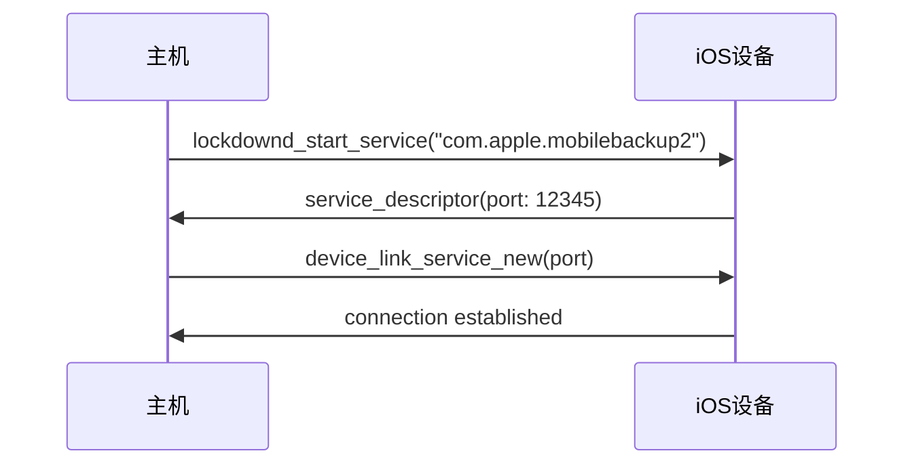
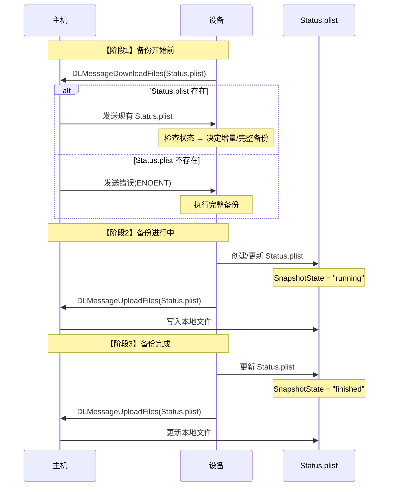

@[TOC](iOS MobileBackup2 通信协议深度解析)

# 前言

本文深入解析 iOS 设备的 MobileBackup2 备份协议，包括完整的通信流程、消息格式、文件传输机制以及关键的 Status.plist 文件处理。适合从事 iOS 设备管理、备份工具开发的工程师阅读。

**关键词**: iOS备份、MobileBackup2、libimobiledevice、DeviceLink协议、Status.plist

---

# 一、协议概述

## 1.1 什么是 MobileBackup2？

MobileBackup2 是 Apple 在 iOS 4.0 引入的设备备份和恢复服务协议，用于替代旧版的 MobileBackup 协议。它基于 **DeviceLink Service** 实现，提供了更强大和灵活的备份功能。

### 核心特性

| 特性 | 说明 |
|-----|------|
| 服务名称 | `com.apple.mobilebackup2` |
| 协议版本 | 2.0 - 2.1 |
| 传输加密 | SSL/TLS |
| 数据格式 | Property List (plist) |
| 支持的操作 | 完整备份、增量备份、选择性恢复、云备份管理 |

### 应用场景

- ✅ iOS 设备完整备份
- ✅ 增量备份（仅备份变更）
- ✅ 加密备份
- ✅ 选择性数据恢复
- ✅ 应用数据迁移

---

## 1.2 协议栈结构

MobileBackup2 协议采用分层设计：

```
┌─────────────────────────────────────┐
│    MobileBackup2 Application        │  应用层 - 备份逻辑
├─────────────────────────────────────┤
│      DeviceLink Service             │  协议层 - 消息封装
├─────────────────────────────────────┤
│   PropertyList Service (SSL/TLS)    │  传输层 - 数据序列化与加密
├─────────────────────────────────────┤
│        USB/Network Transport        │  连接层 - 物理连接
└─────────────────────────────────────┘
```

**分层说明**：
1. **应用层**：实现备份/恢复业务逻辑
2. **协议层**：DeviceLink 消息格式封装
3. **传输层**：plist 序列化 + SSL/TLS 加密
4. **连接层**：USB 或 WiFi 网络传输

---

# 二、通信流程详解

## 2.1 连接建立流程



### 代码实现

```c
// 1. 连接到设备
idevice_t device = NULL;
idevice_new(&device, udid);

// 2. 启动 lockdown 服务
lockdownd_client_t lockdown = NULL;
lockdownd_client_new_with_handshake(device, &lockdown, "backup_tool");

// 3. 启动 mobilebackup2 服务
lockdownd_service_descriptor_t service = NULL;
lockdownd_start_service(lockdown, "com.apple.mobilebackup2", &service);

// 4. 创建 mobilebackup2 客户端
mobilebackup2_client_t client = NULL;
mobilebackup2_client_new(device, service, &client);
```

---

## 2.2 版本协商

连接建立后，客户端和设备需要协商使用的协议版本。

### 请求消息

```json
{
    "MessageName": "Hello",
    "SupportedProtocolVersions": [2.0, 2.1]
}
```

### 响应消息

```json
{
    "MessageName": "Response",
    "ErrorCode": 0,
    "ProtocolVersion": 2.1
}
```

### API 调用

```c
double local_versions[] = {2.0, 2.1};
double remote_version = 0.0;

mobilebackup2_version_exchange(client, local_versions, 2, &remote_version);

printf("协商版本: %.1f\n", remote_version);
```

---

## 2.3 发起备份请求

### 备份选项配置

```c
plist_t options = plist_new_dict();

// 强制完整备份
plist_dict_set_item(options, "ForceFullBackup", plist_new_bool(1));

// 备份路径覆盖
plist_dict_set_item(options, "BackupComputerBasePathOverride", 
                    plist_new_string("/path/to/backup"));

// 指定备份源（可选）
plist_t sources = plist_new_array();
plist_array_append_item(sources, plist_new_string("HomeDomain"));
plist_array_append_item(sources, plist_new_string("AppDomain"));
plist_dict_set_item(options, "Sources", sources);

// 发送备份请求
const char *target_id = "00008110-000664261A83801E";
const char *source_id = "00008110-000664261A83801E";

mobilebackup2_send_request(client, "Backup", target_id, source_id, options);
plist_free(options);
```

### 完整请求结构

```xml
<dict>
    <key>TargetIdentifier</key>
    <string>00008110-000664261A83801E</string>
    
    <key>SourceIdentifier</key>
    <string>00008110-000664261A83801E</string>
    
    <key>Options</key>
    <dict>
        <key>ForceFullBackup</key>
        <true/>
        
        <key>BackupComputerBasePathOverride</key>
        <string>/Users/username/Backups</string>
        
        <key>Sources</key>
        <array>
            <string>HomeDomain</string>
            <string>AppDomain</string>
        </array>
    </dict>
</dict>
```

---

## 2.4 消息处理主循环

备份过程中，主机和设备之间通过消息循环进行通信：

```c
int done = 0;
plist_t message = NULL;
char *dlmsg = NULL;

while (!done) {
    // 接收消息
    mobilebackup2_receive_message(client, &message, &dlmsg);
    
    if (!strcmp(dlmsg, "DLMessageDownloadFiles")) {
        // 【场景1】设备请求从主机下载文件
        // 例如: Status.plist, Info.plist
        mb2_handle_send_files(client, message, backup_dir);
    }
    else if (!strcmp(dlmsg, "DLMessageUploadFiles")) {
        // 【场景2】设备上传文件到主机
        // 例如: 备份的应用数据、照片等
        mb2_handle_receive_files(client, message, backup_dir);
    }
    else if (!strcmp(dlmsg, "DLMessageProcessMessage")) {
        // 【场景3】处理状态消息
        plist_t msg_dict = plist_array_get_item(message, 1);
        
        // 检查错误码
        plist_t error_code = plist_dict_get_item(msg_dict, "ErrorCode");
        if (error_code) {
            uint64_t ec = 0;
            plist_get_uint_val(error_code, &ec);
            
            if (ec != 0) {
                // 备份失败
                plist_t error_desc = plist_dict_get_item(msg_dict, "ErrorDescription");
                char *desc = NULL;
                plist_get_string_val(error_desc, &desc);
                printf("备份失败: %s (错误码: %llu)\n", desc, ec);
                free(desc);
                done = 1;
            }
        }
        
        // 检查备份状态
        plist_t backup_state = plist_dict_get_item(msg_dict, "BackupState");
        if (backup_state) {
            char *state = NULL;
            plist_get_string_val(backup_state, &state);
            
            if (!strcmp(state, "Finished")) {
                printf("备份完成!\n");
                done = 1;
            }
            
            free(state);
        }
    }
    else if (!strcmp(dlmsg, "DLMessageDisconnect")) {
        // 【场景4】设备请求断开连接
        printf("设备请求断开连接\n");
        done = 1;
    }
    
    plist_free(message);
    free(dlmsg);
}
```

---

# 三、DeviceLink 消息格式

## 3.1 消息结构

所有 MobileBackup2 消息都封装在 DeviceLink 数组中：

```xml
<plist version="1.0">
<array>
    <string>DLMessage[MessageType]</string>
    <!-- 消息参数 -->
</array>
</plist>
```

---

## 3.2 主要消息类型

### 3.2.1 DLMessageDownloadFiles

**用途**: 设备请求从主机下载文件

**格式**:
```xml
<array>
    <string>DLMessageDownloadFiles</string>
    <array>
        <!-- 文件路径列表 -->
        <string>00008110-000664261A83801E/Status.plist</string>
        <string>00008110-000664261A83801E/Info.plist</string>
    </array>
    <real>0.0</real>    <!-- 当前进度 -->
    <real>100.0</real>  <!-- 总进度 -->
</array>
```

**处理流程**:
1. 解析文件列表
2. 逐个发送文件（使用文件传输协议）
3. 发送终止标记
4. 返回状态响应

---

### 3.2.2 DLMessageUploadFiles

**用途**: 设备上传文件到主机

**格式**:
```xml
<array>
    <string>DLMessageUploadFiles</string>
    <real>45.5</real>        <!-- 当前进度 -->
    <integer>1048576</integer> <!-- 总大小(字节) -->
</array>
```

**处理流程**:
1. 循环接收文件名和数据
2. 写入本地文件系统
3. 返回状态响应

---

### 3.2.3 DLMessageProcessMessage

**用途**: 状态更新和错误报告

**格式**:
```xml
<array>
    <string>DLMessageProcessMessage</string>
    <dict>
        <key>MessageName</key>
        <string>Response</string>
        
        <key>ErrorCode</key>
        <integer>0</integer>
        
        <key>BackupState</key>
        <string>InProgress</string>  <!-- Finished, Failed -->
        
        <key>BackupTotalSizeEstimated</key>
        <integer>1073741824</integer>
    </dict>
</array>
```

**常见状态值**:
- `BackupState = "InProgress"`: 备份进行中
- `BackupState = "Finished"`: 备份完成
- `BackupState = "Failed"`: 备份失败

---

### 3.2.4 DLMessageStatusResponse

**用途**: 主机响应设备的请求

**格式**:
```xml
<array>
    <string>DLMessageStatusResponse</string>
    <integer>0</integer>  <!-- 状态码 -->
    <string>___EmptyParameterString___</string>  <!-- 状态描述 -->
    <dict>
        <!-- 状态详情（可选） -->
    </dict>
</array>
```

**状态码**:
- `0`: 成功
- `-13`: 多状态（部分成功/失败）
- 其他负值: 各种错误

**API 调用**:
```c
// 成功响应
plist_t empty = plist_new_dict();
mobilebackup2_send_status_response(client, 0, NULL, empty);
plist_free(empty);

// 多状态响应（部分文件错误）
plist_t errors = plist_new_dict();
// 添加错误信息到 errors...
mobilebackup2_send_status_response(client, -13, "Multi status", errors);
plist_free(errors);
```

---

# 四、文件传输协议

## 4.1 传输协议概述

MobileBackup2 使用自定义的二进制帧协议传输文件，格式如下：

```
┌────────────────┬───────────┬──────────────┐
│  4字节长度(BE) │ 1字节代码 │   数据块      │
└────────────────┴───────────┴──────────────┘
```

### 代码常量

```c
#define CODE_SUCCESS      0x00  // 操作成功
#define CODE_ERROR_LOCAL  0x06  // 本地错误
#define CODE_ERROR_REMOTE 0x0b  // 远程错误
#define CODE_FILE_DATA    0x0c  // 文件数据块
```

---

## 4.2 发送文件（主机 → 设备）

### 4.2.1 单文件发送流程

```c
static int send_single_file(mobilebackup2_client_t client,
                            const char *filepath)
{
    FILE *f = fopen(filepath, "rb");
    if (!f) {
        return send_error_frame(client, CODE_ERROR_LOCAL, "File not found");
    }
    
    // 获取文件大小
    fseek(f, 0, SEEK_END);
    size_t total = ftell(f);
    fseek(f, 0, SEEK_SET);
    
    char buf[8192];
    size_t sent = 0;
    uint32_t nlen;
    uint32_t bytes;
    
    // 【步骤1】循环发送数据块
    while (sent < total) {
        // 读取数据
        size_t r = fread(buf + 5, 1, sizeof(buf) - 5, f);
        
        // 构造帧头: 4字节BE长度 + 1字节代码
        nlen = htobe32(r + 1);
        memcpy(buf, &nlen, 4);
        buf[4] = CODE_FILE_DATA;
        
        // 发送帧
        mobilebackup2_send_raw(client, buf, r + 5, &bytes);
        
        sent += r;
        
        // 进度报告
        printf("\r发送进度: %zu / %zu (%.1f%%)", 
               sent, total, (sent * 100.0) / total);
    }
    printf("\n");
    
    fclose(f);
    
    // 【步骤2】发送成功标记
    nlen = htobe32(1);
    memcpy(buf, &nlen, 4);
    buf[4] = CODE_SUCCESS;
    mobilebackup2_send_raw(client, buf, 5, &bytes);
    
    return 0;
}
```

### 4.2.2 批量文件发送

```c
static void handle_download_files_request(
    mobilebackup2_client_t client,
    plist_t message,
    const char *backup_dir)
{
    // 提取文件列表
    plist_t files = plist_array_get_item(message, 1);
    uint32_t file_count = plist_array_get_size(files);
    
    plist_t error_dict = NULL;
    
    // 【步骤1】逐个发送文件
    for (uint32_t i = 0; i < file_count; i++) {
        char *relative_path = NULL;
        plist_get_string_val(plist_array_get_item(files, i), &relative_path);
        
        printf("发送文件 %u/%u: %s\n", i+1, file_count, relative_path);
        
        // 构建完整路径
        char fullpath[PATH_MAX];
        snprintf(fullpath, sizeof(fullpath), "%s/%s", backup_dir, relative_path);
        
        // 发送文件
        int ret = send_single_file(client, fullpath);
        
        if (ret < 0) {
            // 记录错误
            if (!error_dict) {
                error_dict = plist_new_dict();
            }
            add_file_error(error_dict, relative_path, ret);
        }
        
        free(relative_path);
    }
    
    // 【步骤2】发送终止标记（4字节0）
    uint32_t zero = 0;
    uint32_t sent;
    mobilebackup2_send_raw(client, (char*)&zero, 4, &sent);
    
    // 【步骤3】发送状态响应
    if (!error_dict) {
        // 全部成功
        plist_t empty = plist_new_dict();
        mobilebackup2_send_status_response(client, 0, NULL, empty);
        plist_free(empty);
    } else {
        // 部分失败
        mobilebackup2_send_status_response(client, -13, "Multi status", error_dict);
        plist_free(error_dict);
    }
}
```

---

## 4.3 接收文件（设备 → 主机）

### 4.3.1 接收流程图

```
[开始接收]
    ↓
接收4字节长度 → 目录名长度
    ↓
接收目录名字符串
    ↓
接收4字节长度 → 文件名长度
    ↓
接收文件名字符串
    ↓
打开文件准备写入
    ↓
┌──────────────────┐
│ 接收4字节长度     │
│ 接收1字节代码     │
├──────────────────┤
│ 如果代码 = 0x0c: │
│   接收数据块      │
│   写入文件        │
│   继续循环        │
├──────────────────┤
│ 如果代码 = 0x00: │
│   文件接收完成    │
│   关闭文件        │
│   返回接收下一个  │
├──────────────────┤
│ 如果长度 = 0:    │
│   所有文件完成    │
│   退出循环        │
└──────────────────┘
```

### 4.3.2 实现代码

```c
static int receive_filename(mobilebackup2_client_t client, char **filename)
{
    uint32_t nlen = 0;
    uint32_t rlen = 0;
    
    // 接收长度
    mobilebackup2_receive_raw(client, (char*)&nlen, 4, &rlen);
    
    if (rlen != 4) {
        return -1;  // 接收错误
    }
    
    nlen = be32toh(nlen);
    
    // 检查结束标记
    if (nlen == 0) {
        return 0;  // 没有更多文件
    }
    
    // 接收文件名
    *filename = (char*)malloc(nlen + 1);
    mobilebackup2_receive_raw(client, *filename, nlen, &rlen);
    (*filename)[rlen] = '\0';
    
    return nlen;
}

static int handle_upload_files_request(
    mobilebackup2_client_t client,
    plist_t message,
    const char *backup_dir)
{
    int file_count = 0;
    
    while (1) {
        char *dname = NULL;
        char *fname = NULL;
        
        // 【步骤1】接收目录名
        if (receive_filename(client, &dname) == 0) {
            break;  // 所有文件接收完毕
        }
        
        // 【步骤2】接收文件名
        if (receive_filename(client, &fname) == 0) {
            free(dname);
            break;
        }
        
        printf("接收文件: %s/%s\n", dname, fname);
        
        // 【步骤3】打开文件准备写入
        char fullpath[PATH_MAX];
        snprintf(fullpath, sizeof(fullpath), "%s/%s", backup_dir, fname);
        
        // 创建目录
        create_directories_for_file(fullpath);
        
        FILE *f = fopen(fullpath, "wb");
        if (!f) {
            fprintf(stderr, "无法创建文件: %s\n", fullpath);
            free(dname);
            free(fname);
            continue;
        }
        
        // 【步骤4】循环接收数据块
        size_t total_received = 0;
        
        while (1) {
            uint32_t nlen = 0;
            uint32_t rlen = 0;
            
            // 接收长度
            mobilebackup2_receive_raw(client, (char*)&nlen, 4, &rlen);
            nlen = be32toh(nlen);
            
            if (nlen == 0) {
                break;  // 文件结束
            }
            
            // 接收代码
            char code = 0;
            mobilebackup2_receive_raw(client, &code, 1, &rlen);
            
            if (code == CODE_FILE_DATA) {
                // 接收数据块
                uint32_t blocksize = nlen - 1;
                char buf[8192];
                uint32_t bdone = 0;
                
                while (bdone < blocksize) {
                    uint32_t to_read = (blocksize - bdone > sizeof(buf)) 
                                     ? sizeof(buf) : (blocksize - bdone);
                    
                    mobilebackup2_receive_raw(client, buf, to_read, &rlen);
                    fwrite(buf, 1, rlen, f);
                    bdone += rlen;
                    total_received += rlen;
                }
                
                // 进度报告
                printf("\r  已接收: %zu 字节", total_received);
                fflush(stdout);
            }
            else if (code == CODE_SUCCESS) {
                // 文件传输成功
                printf("\n  文件接收完成\n");
                break;
            }
            else if (code == CODE_ERROR_LOCAL || code == CODE_ERROR_REMOTE) {
                // 传输错误
                fprintf(stderr, "\n  文件传输错误: 代码 0x%02x\n", code);
                break;
            }
        }
        
        fclose(f);
        free(dname);
        free(fname);
        file_count++;
    }
    
    // 【步骤5】发送状态响应
    plist_t empty = plist_new_dict();
    mobilebackup2_send_status_response(client, 0, NULL, empty);
    plist_free(empty);
    
    printf("总共接收 %d 个文件\n", file_count);
    return file_count;
}
```

---

# 五、Status.plist 深度解析

## 5.1 作用和重要性

`Status.plist` 是 MobileBackup2 协议中的**核心状态文件**，用于：

| 功能 | 说明 |
|-----|------|
| 🔸 **状态持久化** | 记录备份/恢复操作的最终状态 |
| 🔸 **备份类型识别** | 区分完整备份和增量备份 |
| 🔸 **完整性验证** | 验证备份是否成功完成 |
| 🔸 **错误诊断** | 提供详细的错误信息 |
| 🔸 **恢复前检查** | 确保从有效备份恢复 |

---

## 5.2 文件位置和目录结构

```
备份根目录/
  └── 设备UDID/
      ├── Status.plist          ← 状态文件（本文重点）
      ├── Info.plist            ← 设备信息
      ├── Manifest.plist        ← 文件清单
      ├── Manifest.mbdb         ← 文件元数据（旧版）
      └── <SHA1-hash>/          ← 备份文件（按哈希值组织）
          ├── ab/
          │   └── abc123...     ← 实际备份文件
          ├── cd/
          └── ...
```

**示例路径**:
```
/Users/username/Backups/00008110-000664261A83801E/Status.plist
```

---

## 5.3 Status.plist 文件格式

### 5.3.1 MobileBackup2 格式（iOS 4+）

```xml
<?xml version="1.0" encoding="UTF-8"?>
<!DOCTYPE plist PUBLIC "-//Apple//DTD PLIST 1.0//EN" 
    "http://www.apple.com/DTDs/PropertyList-1.0.dtd">
<plist version="1.0">
<dict>
    <!-- 【核心字段】快照状态 -->
    <key>SnapshotState</key>
    <string>finished</string>  <!-- 可选值: running, finished, failed -->
    
    <!-- 协议版本 -->
    <key>Version</key>
    <string>2.1</string>
    
    <!-- 备份时间 -->
    <key>Date</key>
    <date>2024-12-12T08:00:00Z</date>
    
    <!-- 是否为完整备份 -->
    <key>IsFullBackup</key>
    <true/>
    
    <!-- 备份状态 -->
    <key>BackupState</key>
    <string>Finished</string>  <!-- 可选值: InProgress, Finished, Failed -->
    
    <!-- UUID（可选） -->
    <key>UUID</key>
    <string>E621E1F8-C36C-495A-93FC-0C247A3E6E5F</string>
</dict>
</plist>
```

### 5.3.2 字段说明

| 字段 | 类型 | 说明 | 可选值 |
|-----|------|------|--------|
| `SnapshotState` | string | **最重要**的状态标识 | `running`, `finished`, `failed` |
| `Version` | string | 协议版本号 | `2.0`, `2.1` |
| `Date` | date | 备份完成时间 | ISO 8601 格式 |
| `IsFullBackup` | boolean | 是否为完整备份 | `true` / `false` |
| `BackupState` | string | 备份状态描述 | `InProgress`, `Finished`, `Failed` |
| `UUID` | string | 备份唯一标识 | UUID 格式 |

### 5.3.3 MobileBackup 旧格式（iOS 3.x）

```xml
<dict>
    <key>Backup Success</key>
    <true/>  <!-- 或 <false/> -->
</dict>
```

---

## 5.4 Status.plist 的生命周期

### 时序图



---

## 5.5 状态检查实现

### 5.5.1 读取并验证状态

```c
/**
 * 检查备份快照状态
 * 
 * @param backup_dir 备份目录